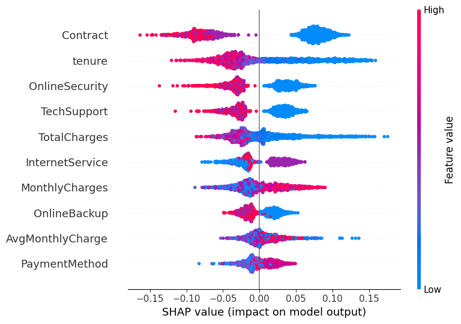
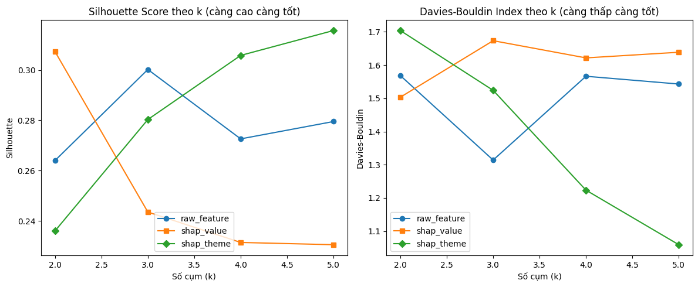

# Chuyên đề nghiên cứu: Phân tích khách hàng rời mạng viễn thông với SHAP và persona giữ chân

- Tên người làm: Vũ Trung Kiên
- Mã học viên: 250104011
- Chuyên đề: Phân tích dữ liệu - IS6502.CH201
- Giảng viên hướng dẫn: Thầy Nguyễn Đình Thuân

## Mục tiêu nghiên cứu
Dự án xây dựng quy trình dự đoán khách hàng rời mạng trong viễn thông, đồng thời giải thích nguyên nhân churn và chuyển kết quả giải thích thành persona giữ chân có thể dùng cho báo cáo học thuật và đề xuất kinh doanh.

## Điểm mới của đề tài
Đề tài không chỉ dừng ở việc huấn luyện mô hình phân loại. Pipeline được xây dựng theo ba tầng:
1. Prediction layer: dự đoán khả năng rời mạng bằng nhiều mô hình học máy.
2. Explanation layer: dùng SHAP để xác định các yếu tố ảnh hưởng mạnh nhất đến churn.
3. Action layer: gom cụm theo SHAP theme để tạo persona và đề xuất chiến lược giữ chân.

Điểm quan trọng là phần này đã được đồng bộ theo kết quả mới nhất trong paper.

## Kết quả mới nhất
- Dataset: 7.043 khách hàng, churn rate 26,54%.
- Logistic Regression đạt accuracy cao nhất: 0.7903.
- Random Forest được chọn làm mô hình nền tảng cho SHAP: accuracy 0.7846, F1-score 0.5524, AUC 0.8148.
- SHAP top feature: `Contract`, tiếp theo là `tenure`, `OnlineSecurity`, `TechSupport`, `TotalCharges`.
- Ablation tốt nhất: `shap_theme`, silhouette 0.3157.
- Persona cuối cùng: 5 cụm với kích thước 230, 582, 237, 225 và 133.

## Minh họa trực quan
### SHAP summary


### So sánh không gian gom cụm


## Luồng xử lý chính
1. Tiền xử lý dữ liệu: xử lý giá trị thiếu, mã hóa biến phân loại, tạo đặc trưng mới.
2. Huấn luyện mô hình: so sánh nhiều mô hình học máy và chọn mô hình phù hợp để giải thích.
3. Giải thích mô hình: dùng SHAP để phân tích mức ảnh hưởng của từng đặc trưng.
4. Gom cụm persona: nhóm khách hàng theo theme nguyên nhân rời mạng.
5. Kiểm định thống kê: Kruskal-Wallis và effect size cho các theme persona.

## Cấu trúc thư mục chính
- `data/`: dữ liệu gốc và dữ liệu train/test đã tiền xử lý.
- `src/`: mã nguồn tiền xử lý, huấn luyện, giải thích.
- `reports/`: bảng kết quả, persona, hình ảnh SHAP và ablation.
- `docs/`: tài liệu mô tả dự án.
- `latex/`: bản thảo paper.

## Ghi chú cho paper
Bản thảo ở `latex/main_vn.tex` và `latex/main.tex` đã được đồng bộ với các file trong `reports/`. Khi trích dẫn kết quả, nên ưu tiên:
- `reports/model_comparison.csv`
- `reports/shap_feature_importance.csv`
- `reports/ablation_raw_vs_shap.csv`
- `reports/persona_retention_recommendations.csv`

## Chạy nhanh
```bash
pip install -r requirements.txt
python src/demo.py
```
